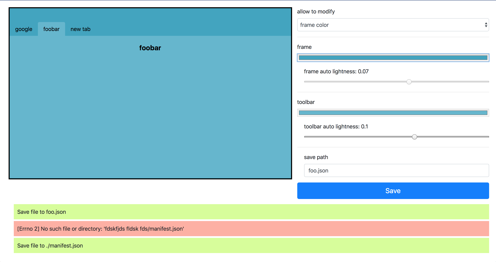

# chrome theme generator

Generate chrome theme manifest.json based on two colors:
- frame (top browser panel) 
- toolbar (optional, by default will be slightly lighter then frame color)

If selected toolbar color is light then tab and new tab text will be black / grey, otherwise white / light grey.

## usage

### cli
```bash
# start Q&A-like theme generator and follow step
python main.py
# you can also specify config with predefined values
python main.py config.ini
```

### web
```bash
# start interactive session, go to localhost:8000 and check it out
python app.py
```


